# 🛡️ AI GRC Audit Suite

**AI-powered audit toolkit for the Saudi Arabia and Gulf compliance market.**

Built for GRC auditors and consultants who need to produce professional deliverables faster — without enterprise tool price tags.

> Built by **kayShahbaaz** (kayn0x) · May 2026 – August 2026

---

## Screenshots

### Home
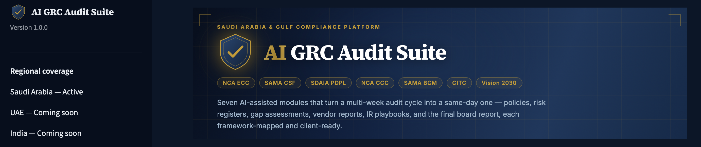

### Company Profile
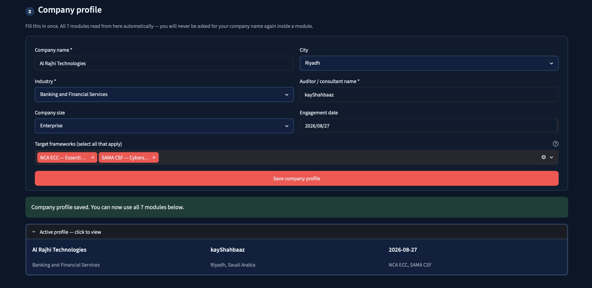

### 1 · Policy Generator — NCA ECC Access Control Policy
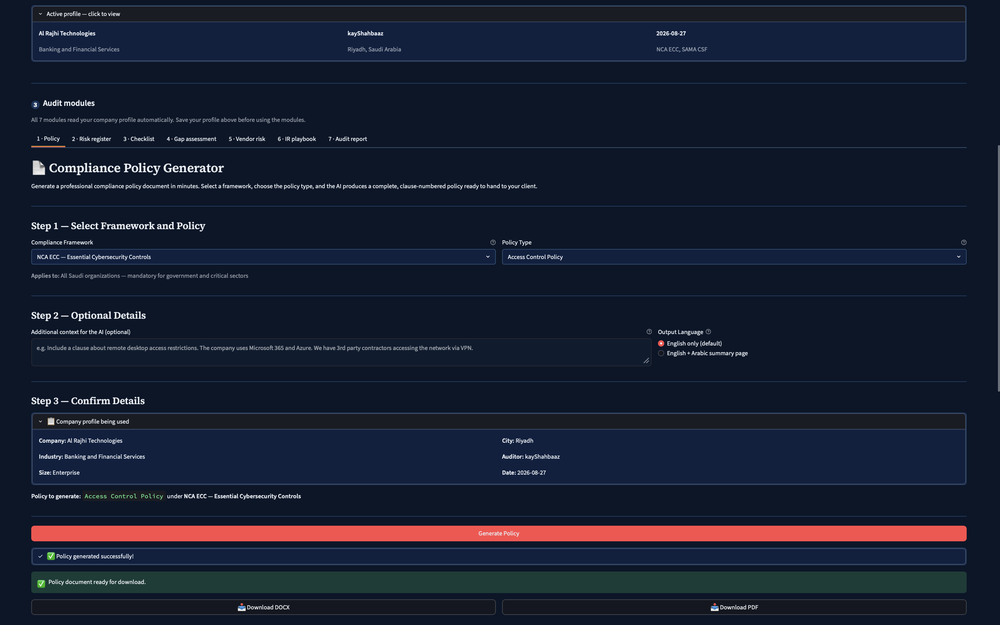

### 2 · Risk Register — SAMA CSF · Cloud Infrastructure · 10 Risks
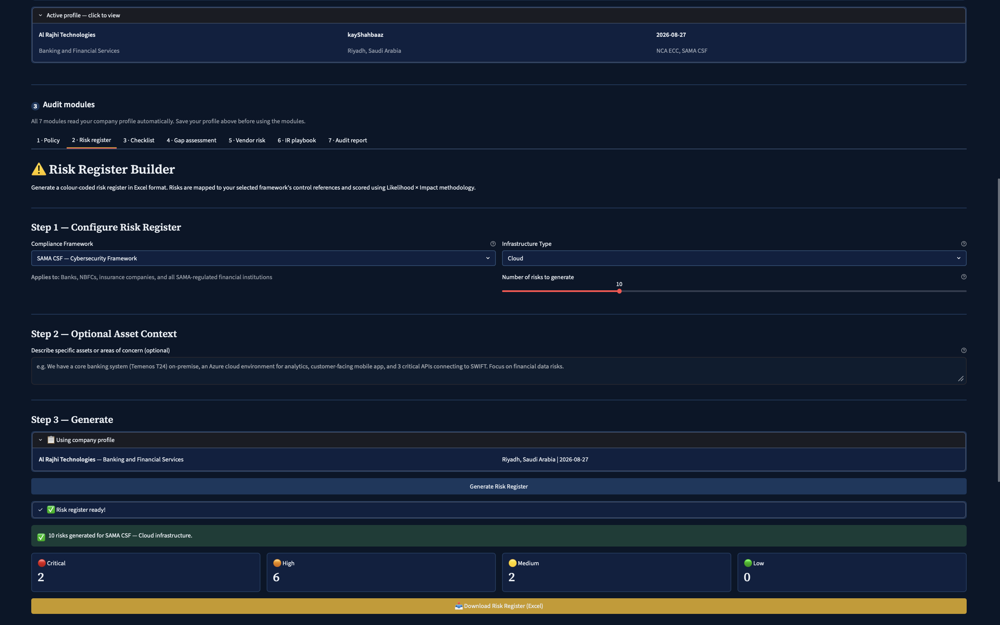

### 3 · Audit Checklist — NCA ECC Full Framework · 27 Controls in 4 Batches
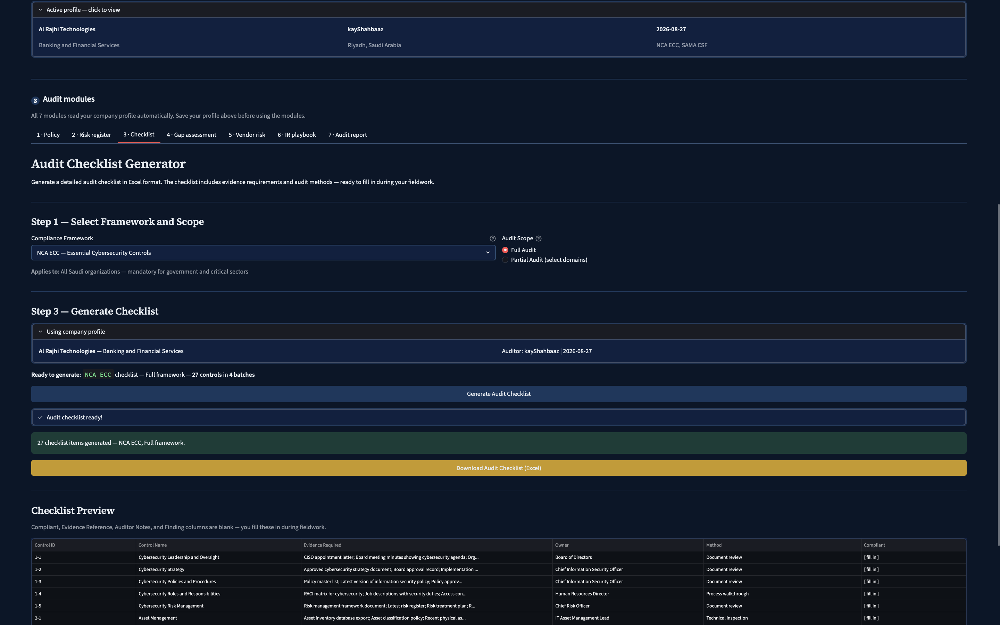

### 4 · Gap Assessment — NCA ECC · 27 Controls · RAG Pipeline
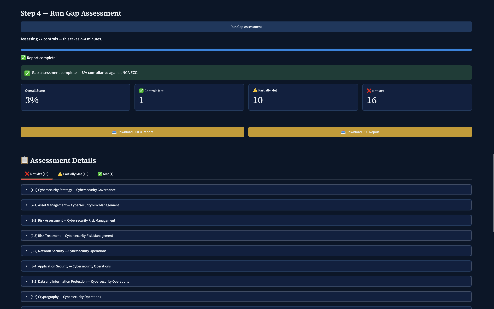
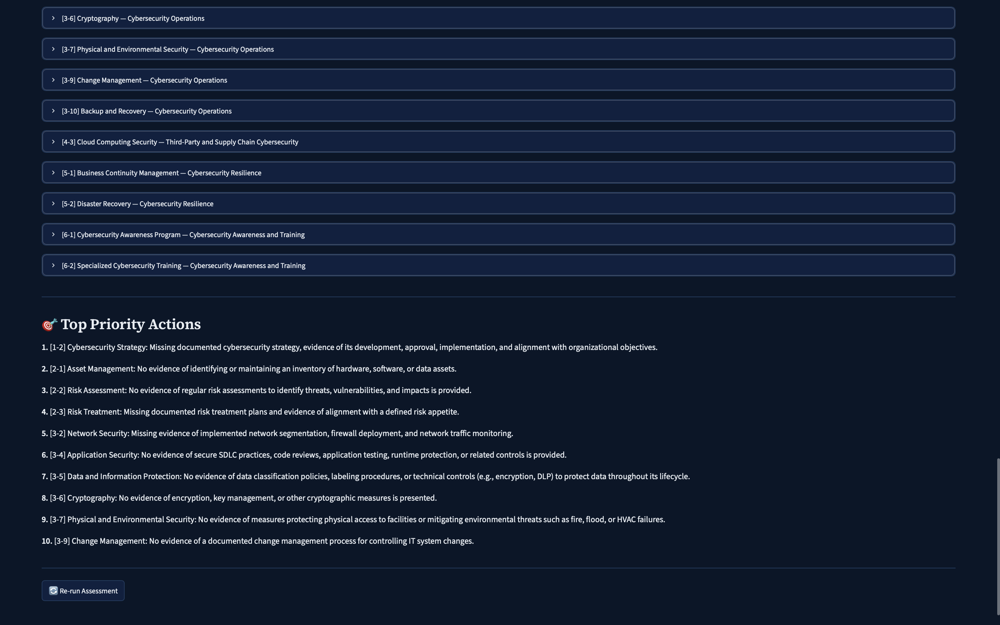

### 5 · Vendor Risk Assessment — Microsoft Azure · High Risk · Score 68/100
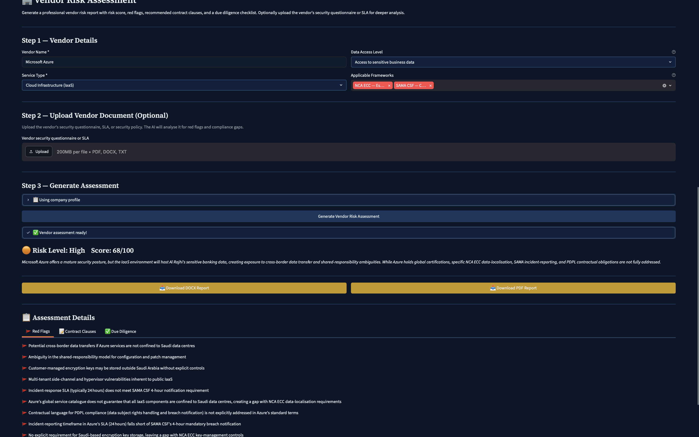

### 6 · IR Playbook — Ransomware · Critical Severity
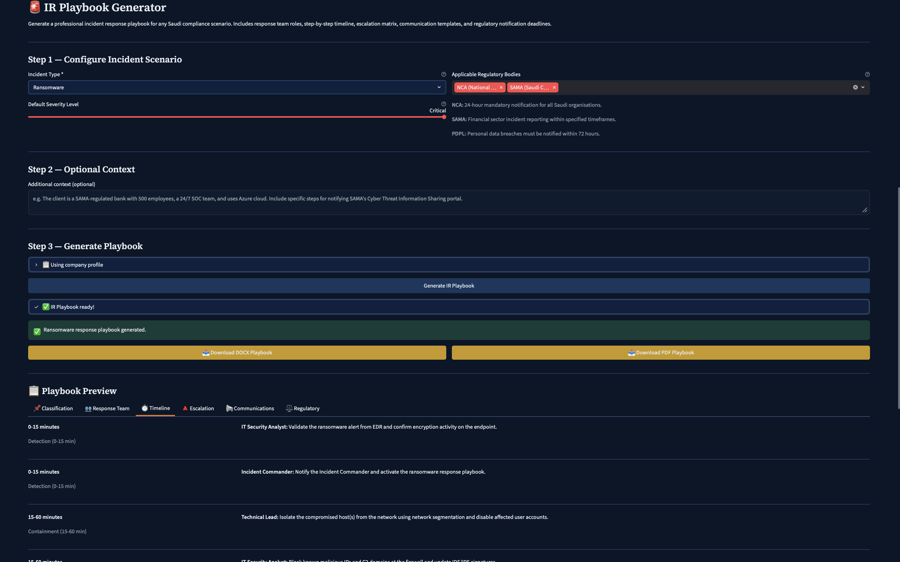
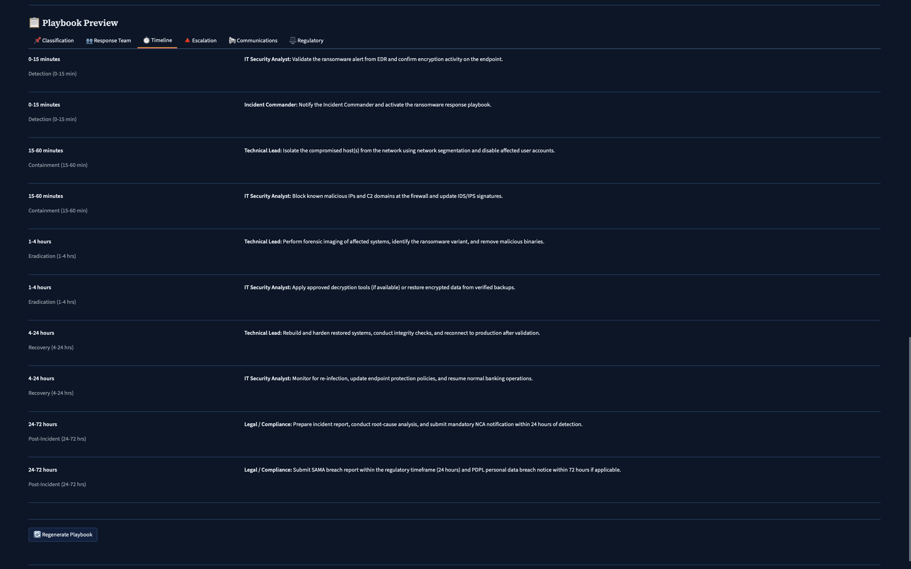

### 7 · Audit Report — 40 Findings Auto-Collected from All Modules
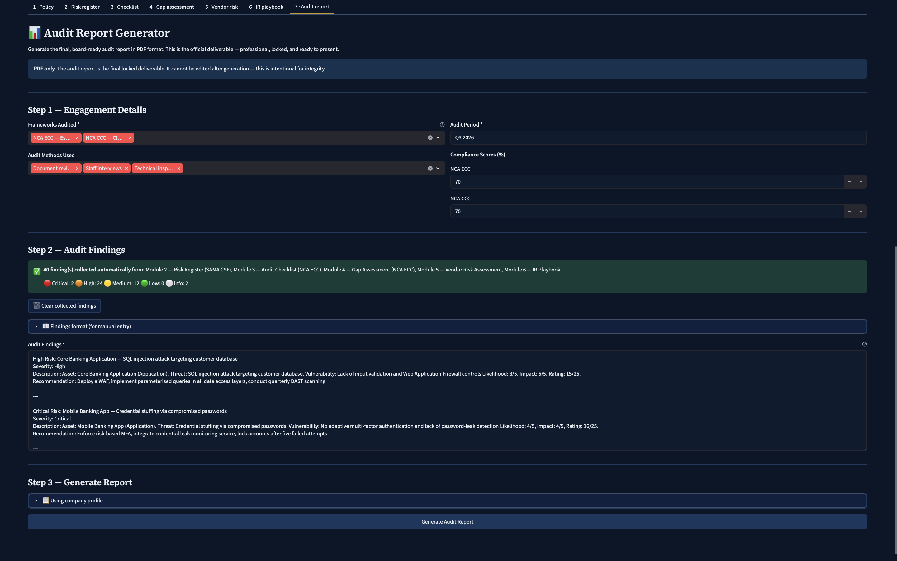
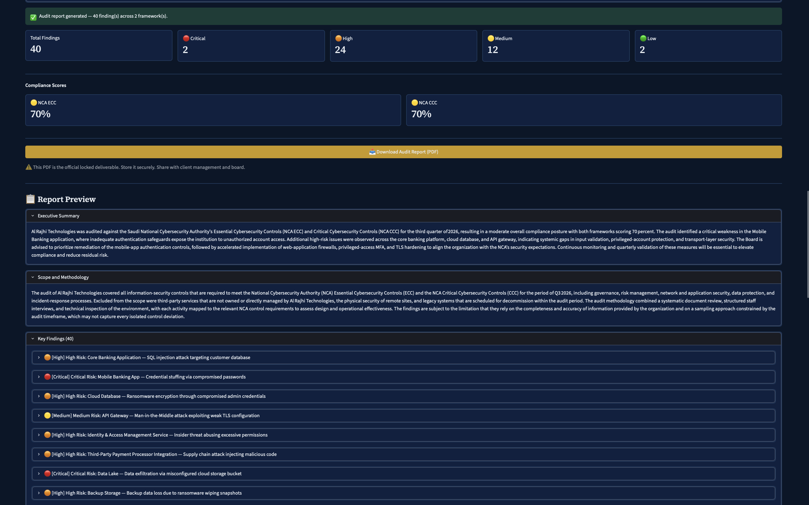
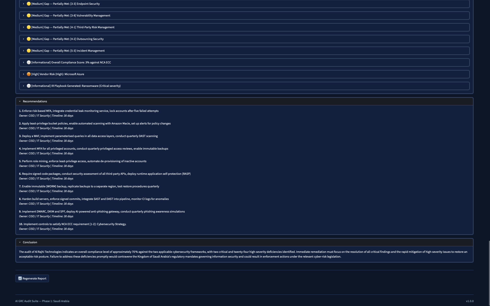

---

[](https://aigrc-audit-suite.streamlit.app)

---

## Sample Output Files

Real deliverables generated by the tool for Al Rajhi Technologies (Banking, Riyadh):

| File | Module | Format |
|------|--------|--------|
| [Access Control Policy — NCA ECC](samples/Al_Rajhi_Technologies_Access_Control_Policy_NCA_ECC.pdf) | Policy Generator | PDF |
| [Risk Register — SAMA CSF](samples/Al_Rajhi_Technologies_Risk_Register_SAMA_CSF.xlsx) | Risk Register | Excel |
| [Audit Checklist — NCA ECC](samples/Al_Rajhi_Technologies_Audit_Checklist_NCA_ECC.xlsx) | Audit Checklist | Excel |
| [Gap Assessment — NCA ECC](samples/Al_Rajhi_Technologies_Gap_Assessment_NCA_ECC.pdf) | Gap Assessment | PDF |
| [Vendor Risk — Microsoft Azure](samples/Al_Rajhi_Technologies_Vendor_Risk_Microsoft_Azure.pdf) | Vendor Risk | PDF |
| [IR Playbook — Ransomware](samples/Al_Rajhi_Technologies_IR_Playbook_Ransomware.pdf) | IR Playbook | PDF |
| [Audit Report — Q3 2026](samples/Al_Rajhi_Technologies_Audit_Report_Q3_2026.pdf) | Audit Report | PDF |

---

## What It Does

7 AI-powered audit modules covering the full audit lifecycle:

| Module | Output | What it generates |
|--------|--------|-------------------|
| 1. Policy Generator | DOCX + PDF | Complete numbered-clause policies mapped to Saudi frameworks |
| 2. Risk Register | Excel | Colour-coded risk register with threat mapping and control references |
| 3. Audit Checklist | Excel | Evidence-requirements checklist with audit methods, ready for fieldwork |
| 4. Gap Assessment | DOCX + PDF | RAG pipeline — AI reads client documents and assesses each control |
| 5. Vendor Risk | DOCX + PDF | Risk score, red flags, contract clauses, due diligence checklist |
| 6. IR Playbook | DOCX + PDF | Response team, timeline, escalation matrix, regulatory deadlines |
| 7. Audit Report | PDF | Final board-ready report with findings, scores, and recommendations |

---

## Saudi Arabia Frameworks — Phase 1

| Framework | Full Name | Authority | Applies To |
|-----------|-----------|-----------|------------|
| NCA ECC | Essential Cybersecurity Controls | NCA | All Saudi organisations — mandatory |
| NCA CCC | Cloud Cybersecurity Controls | NCA | Cloud service providers |
| NCA CSCC | Cybersecurity Controls for Critical Sectors | NCA | Critical infrastructure |
| SAMA CSF | Cybersecurity Framework | Saudi Central Bank | Banks, NBFCs, financial institutions |
| SAMA BCM | Business Continuity Management | Saudi Central Bank | SAMA-regulated entities |
| SDAIA PDPL | Personal Data Protection Law | SDAIA | Any organisation handling personal data |
| CITC | Communications and IT Commission Guidelines | CST | Telecom and ICT companies |
| Vision 2030 | Digital Transformation Cybersecurity Requirements | KSA | Government-aligned entities |

---

## How the Gap Assessment Works (Module 4)

Module 4 uses RAG (Retrieval-Augmented Generation) — the most technically sophisticated module:

1. **Upload** — client's existing policies, procedures, and security docs (PDF / DOCX / TXT)
2. **Chunk** — documents split into ~1000-character overlapping chunks
3. **Embed** — each chunk embedded locally using HuggingFace `all-mpnet-base-v2`
4. **Store** — embeddings stored in ChromaDB on disk (stays local)
5. **Assess** — for each framework control, retrieve the 5 most relevant chunks
6. **Verdict** — AI assesses: Met / Partially Met / Not Met per control
7. **Report** — full gap report with compliance score, priority actions, control mapping

**Privacy:** Client documents are processed locally. Only small relevant excerpts — not full documents — are sent to the AI for each individual control assessment.

---

## Quick Start

### 1. Clone

```bash
git clone https://github.com/kayn0x/aigrc-audit-suite
cd aigrc-audit-suite
```

### 2. Install dependencies

```bash
pip install -r requirements.txt
```

> First run of Module 4 (Gap Assessment) downloads the HuggingFace embedding model (~420MB). Internet required once — cached locally after that.

### 3. Add your Groq API key

```bash
cp .env.example .env
```

Open `.env` and paste your key:

```
GROQ_API_KEY=gsk_your-key-here
```

Get a free key at [console.groq.com](https://console.groq.com) — no credit card required.

### 4. Run

```bash
streamlit run app.py
```

Opens at `http://localhost:8501`

---

## Project Structure

```
aigrc-audit-suite/
├── app.py                      ← Main Streamlit app
├── config/
│   ├── frameworks.py           ← All 8 Saudi framework definitions and controls
│   └── settings.py             ← App constants, model names, thresholds
├── modules/
│   ├── policy.py               ← Module 1: Policy Generator
│   ├── risk.py                 ← Module 2: Risk Register Builder
│   ├── checklist.py            ← Module 3: Audit Checklist Generator
│   ├── gap.py                  ← Module 4: Gap Assessment Tool (RAG)
│   ├── vendor.py               ← Module 5: Vendor Risk Assessment
│   ├── playbook.py             ← Module 6: IR Playbook Generator
│   └── report.py               ← Module 7: Audit Report Generator
├── utils/
│   ├── groq_client.py          ← Single entry point for all AI calls
│   ├── embeddings.py           ← HuggingFace all-mpnet-base-v2 wrapper
│   ├── vectorstore.py          ← ChromaDB operations (RAG infrastructure)
│   ├── findings_store.py       ← Shared findings store across modules
│   ├── docx_exporter.py        ← DOCX generation for Modules 1, 4, 5, 6
│   ├── pdf_exporter.py         ← PDF generation for all modules
│   └── excel_exporter.py       ← Excel generation for Modules 2, 3
├── assets/
│   └── logo.svg                ← App shield logo
├── samples/                    ← Real generated output files
├── screenshots/                ← App screenshots for this README
├── data/chroma_db/             ← ChromaDB vector storage (auto-created)
├── requirements.txt
├── .env.example
└── .gitignore
```

---

## Tech Stack — All Free

| Component | Tool | Purpose |
|-----------|------|---------|
| UI | Streamlit | Multi-tab web interface |
| LLM | Groq (openai/gpt-oss-120b) | AI generation — free tier |
| Embeddings | HuggingFace all-mpnet-base-v2 | Local document embedding for RAG |
| Vector DB | ChromaDB | Local persistent vector storage |
| Document chunking | LangChain text splitters | Splits docs for RAG pipeline |
| DOCX export | python-docx | Word documents |
| PDF export | FPDF2 | Locked PDF reports |
| Excel export | openpyxl | Colour-coded spreadsheets |

---

## Deployment on Railway.app

```bash
npm install -g @railway/cli
railway login
railway init
railway up
```

Set in Railway dashboard:
- `GROQ_API_KEY` = your Groq key

> Module 4 requires ChromaDB persistence. Configure a Railway volume at `./data/chroma_db/`.

---

## Roadmap

| Phase | Region | Status |
|-------|--------|--------|
| Phase 1 | 🇸🇦 Saudi Arabia | ✅ Complete |
| Phase 2 | 🇦🇪 UAE | 🔜 Coming Soon |
| Phase 3 | 🇮🇳 India | 🔜 Coming Soon |

---

## Built By

**kayShahbaaz** (kayn0x) — Cybersecurity GRC analyst and auditor building practical tools for the Saudi and Gulf compliance market.

This project demonstrates AI-powered audit toolkit development with deep knowledge of Saudi frameworks including NCA ECC, SAMA CSF, and SDAIA PDPL.

---

*AI GRC Audit Suite — Phase 1: Saudi Arabia*

---

